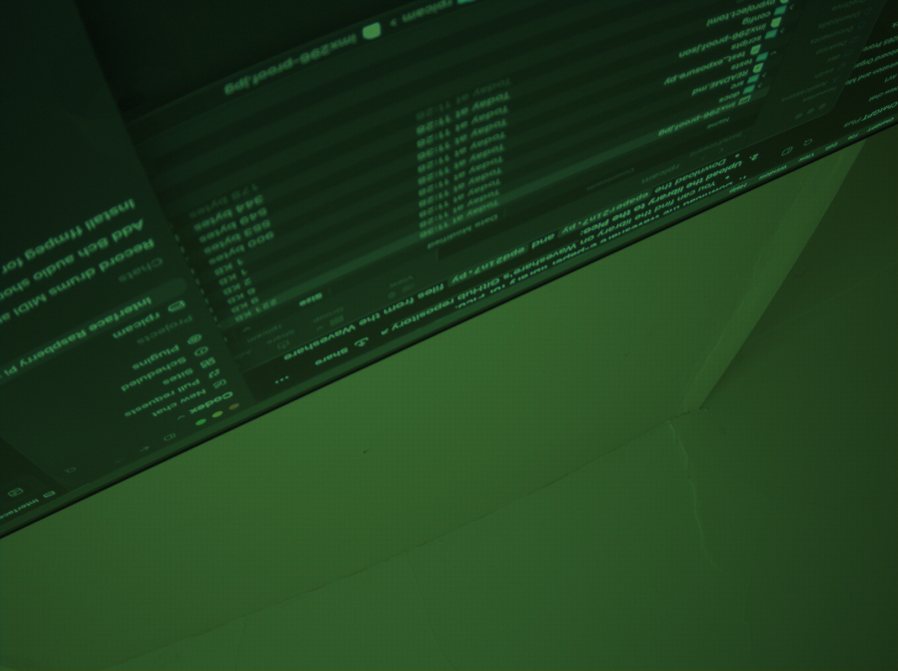

# IMX296 full-resolution alternating-exposure RAW HDR

<!-- repository-status:start -->
## Repository status

This repository is public.

- The current state is **active**.
- The repository contains full-resolution RAW capture, metadata checks, frame separation, calibration, high-dynamic-range processing, and output tools.
- The repository contains source, tests, architecture documents, and retained hardware-validation images and metadata.
- The work is hardware-adjacent. It does not establish firmware, device-driver, or operating-system development.
- The local unit tests do not exercise the Raspberry Pi camera hardware.
- Publication status: **Published project under active development.**
<!-- repository-status:end -->


This project captures full-resolution RAW high-dynamic-range (HDR) images. It uses a Raspberry Pi 5 and an Arducam 261 camera with a Sony IMX296 sensor.



The system records two sequential Bayer measurements for each output frame:

- Image size: 1456 x 1088 pixels.
- Sensor rate: approximately 60 frames each second.
- Short exposure: approximately 1 ms.
- Long exposure: approximately 14.8 ms.
- Output rate: 30 exposure pairs each second.
- Storage: lossless RAW10 codes in little-endian 16-bit containers.
- Verification: actual exposure and sensor timestamp from each frame.

The interleaved RAW file is the measurement master. The short-exposure and long-exposure arrays are also measurement products.

The MP4 file is only a viewable derivative. Do not use the MP4 file as scientific data.

## Verified hardware

The verified system has these items:

- Raspberry Pi 5.
- Arducam 261 camera.
- Sony IMX296 sensor.
- 1456 x 1088 RAW10 sensor mode.

The system does not require an external trigger, GPIO, soldering, wiring, boot changes, or kernel changes. It does not require a system-wide libcamera installation.

## Why the libcamera patch is necessary

Standard Picamera2 and libcamera controls did not keep the exposure sequence stable. The controls passed through shared automatic gain control state.

The delayed sensor-control queue then received one exposure value. Thus, the alternating exposure sequence stopped.

The optional patch applies the two exposures at the delayed sensor-control boundary. It uses the frame context to select the applicable exposure.

The patch operates only with the IMX296 sensor. It also selects uncompressed `SBGGR16` transport instead of the usual compressed RAW transport.

Use the patch with libcamera tag `v0.7.0+rpt20260205`. The patch and its build instructions are in [`patches/`](patches/).

Do not replace the system camera stack. Use process-local library and IPA paths.

## Prepare the camera software

Install the local processing package before you use the tools:

```bash
python3 -m pip install -e .
```

The capture experiments also require the Raspberry Pi `libcamera` Python
bindings. The preview and video tools call `ffmpeg` as an external command.

1. Build the patch for the specified libcamera tag.
2. Set the process-local library and IPA paths.
3. Enable the IMX296 alternating-exposure mode:

```bash
export LIBCAMERA_RPI_IMX296_HDR_ALT=1
```

## Capture an alternating-exposure sequence

The capture program first records the frames in memory. It writes the frames to storage after the camera stops.

This method prevents storage or network traffic from stopping the sensor. A typical two-second run keeps 120 frames after startup.

1. Enable the patched camera software.
2. Run the capture command:

```bash
python3 experiments/libcamera_raw_sequence.py \
  --frames 128 --discard 8 --short-us 1000 --long-us 15000 \
  --frame-us 16667 --buffers 4 --output-dir RUN_DIR
```

3. Read the actual exposure values from `frames.csv`.
4. Confirm that the file contains 60 frames at each exposure.
5. Confirm that adjacent frames do not have the same exposure.
6. Confirm that sensor timestamp intervals are near 16,667 us.

The patch converts the requested exposures to 992 us and 14,829 us. The metadata values are the authoritative values.

## Split the RAW master

Split the interleaved master into unchanged short-exposure and long-exposure arrays:

```bash
python3 tools/split_raw_sequence.py RUN_DIR
```

## Make the HDR preview

The merge tool operates in the Bayer domain. It subtracts RAW10 black code 60 from each measurement.

The tool divides each result by its metadata exposure time. This operation produces a linear radiance estimate.

The merge uses the long exposure where it is valid. It changes gradually to the short exposure between RAW codes 820 and 980.

The preview process uses these operations:

- Bilinear BGGR demosaic.
- Fixed white balance.
- Fixed 3 x 3 color-correction matrix.
- Global white point from the first merged frame.
- Reinhard highlight compression.
- sRGB display encoding.
- H.264 video encoding.

The preview does not use local tone mapping or temporal adaptation.

Make the preview:

```bash
python3 tools/merge_hdr_sequence.py RUN_DIR
```

## Make linear radiance output

The linear-radiance process uses this order:

1. Interpolate a virtual dark frame for the actual exposure.
2. Subtract the virtual dark frame in the Bayer domain.
3. Divide the result by the actual exposure time in seconds.
4. Keep the float32 Bayer samples, including negative noise values.

The process does not apply a demosaic, clamp, white balance, color matrix, gamma, tone curve, or video encoding.

Make the linear-radiance output:

```bash
python3 tools/calibrate_linear_radiance.py RUN_DIR DARK_LIBRARY_DIR
```

The output uses little-endian float32 BGGR Bayer values. Its unit is RAW10 counts each second.

The `linear_radiance/` directory contains the calibrated sources, optional fused pairs, hashes, and processing metadata.

## Capture an independent still bracket

The still-capture script records one RAW image at each exposure point. It uses a 1-2-5 sequence from 1 ms through 10 seconds.

Each image has its own metadata and hash.

Run the still-capture script:

```bash
scripts/capture_still_bracket.sh
```

## Stack calibrated stills

The stack tool replaces each clipped RAW10 value with `NaN`. It then calculates an exposure-squared weighted mean from finite samples.

Clipped samples have no effect on the result. Long exposures supply clean data, and short exposures supply valid highlight data.

Make the stack:

```bash
python3 tools/stack_linear_radiance.py STILL_BRACKET_DIR
```

Use `--weighting uniform` only when you require an unweighted finite mean.

The output includes these files:

- A self-describing float32 TIFF file.
- A headerless `.raw32f` computation array.
- A 16-bit TIFF contributor map.

The contributor map gives the finite sample count at each Bayer pixel.

## Export still TIFF files

Export the RAW images, calibrated images, and merged 48-bit linear RGB image:

```bash
python3 tools/export_still_bracket_tiffs.py STILL_BRACKET_DIR
```

The exporter also makes 16-bit linear Bayer viewing copies. These copies use one global white scale without gamma or a tone curve.

The float32 physical-unit TIFF files do not change. The exporter also makes 48-bit color previews of each calibrated image and the merged image.

One shared RGB interval controls all preview images. The interval excludes the lowest and highest 0.01 percent of values.

This limit prevents hot pixels from using the complete display range. The preview does not use channel-specific normalization, gamma, or a tone curve.

## Apply the measured color response

Apply the measured IMX296 RGB gains and color-response matrix:

```bash
python3 tools/render_colour_response.py STILL_BRACKET_DIR
```

The tool makes a full-range affine preview and a shared 0.1-99.9 percent preview. These files are viewable derivatives.

The Bayer radiance master does not change. The previews do not use gamma, a tone curve, or channel-specific normalization.

The tool also makes a display-only tone-mapped TIFF file. Its metadata records all tone-map parameters.

The tone map applies the Reinhard operation to luminance one time. It changes chroma only when the display RGB limit makes that change necessary.

## Make a dark-frame calibration library

Dark signal depends on the pixel, exposure, analog gain, and sensor temperature. Keep the analog gain at 1.0.

Record the sensor temperature with each set. Use this initial exposure grid:

```text
1, 2, 5, 10, 20, 50, 100, 200, 500, 1000 ms
```

1. Install the lens cap.
2. Capture at least 10 RAW frames at each exposure.
3. Keep the individual frames and their average.
4. Use a separate still or slow-sequence mode for long exposures.

The fixed 60 fps stream cannot collect long dark exposures. The sensor frame duration must be longer than the exposure.

Capture the dark-frame grid:

```bash
scripts/capture_dark_library.sh
```

Set `RPICAM_RETAINED_FRAMES` to change the number of retained frames. Set `RPICAM_DISCARD_FRAMES` to change the number of discarded startup frames.

Build the float32 mean masters and make a virtual dark frame:

```bash
python3 tools/build_dark_library.py DARK_RUN_DIR
python3 tools/synthesize_dark.py DARK_RUN_DIR 55000 virtual_55000us.raw32f
```

The interpolation uses actual metadata exposure times. The tool stops if the requested exposure is outside the calibrated range.

## Run the tests

Run all unit tests:

```bash
python3 -m pip install -e .
python3 -m unittest discover -s tests -v
```

These tests validate exposure calculations and colour-processing functions.
They do not capture data or validate connected camera hardware.

## Data policy


The `.gitignore` file excludes capture files. Publish hashes and small metadata manifests when a run requires a public reference.

## Author

Swithin Feely maintains this project. The GitHub account is [`swithmario`](https://github.com/swithmario).

## Copyright and third-party code

The original project code has no open-source licence. See
[`COPYRIGHT.md`](COPYRIGHT.md). The libcamera patch modifies upstream files
that use LGPL-2.1-or-later. See [`THIRD_PARTY.md`](THIRD_PARTY.md) and the
licence copy in
[`patches/LICENSE-LGPL-2.1-or-later.txt`](patches/LICENSE-LGPL-2.1-or-later.txt).
